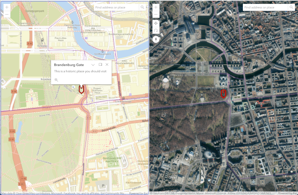

![Built With Stencil](https://img.shields.io/badge/-Built%20With%20Stencil-16161d.svg?logo=data%3Aimage%2Fsvg%2Bxml%3Bbase64%2CPD94bWwgdmVyc2lvbj0iMS4wIiBlbmNvZGluZz0idXRmLTgiPz4KPCEtLSBHZW5lcmF0b3I6IEFkb2JlIElsbHVzdHJhdG9yIDE5LjIuMSwgU1ZHIEV4cG9ydCBQbHVnLUluIC4gU1ZHIFZlcnNpb246IDYuMDAgQnVpbGQgMCkgIC0tPgo8c3ZnIHZlcnNpb249IjEuMSIgaWQ9IkxheWVyXzEiIHhtbG5zPSJodHRwOi8vd3d3LnczLm9yZy8yMDAwL3N2ZyIgeG1sbnM6eGxpbms9Imh0dHA6Ly93d3cudzMub3JnLzE5OTkveGxpbmsiIHg9IjBweCIgeT0iMHB4IgoJIHZpZXdCb3g9IjAgMCA1MTIgNTEyIiBzdHlsZT0iZW5hYmxlLWJhY2tncm91bmQ6bmV3IDAgMCA1MTIgNTEyOyIgeG1sOnNwYWNlPSJwcmVzZXJ2ZSI%2BCjxzdHlsZSB0eXBlPSJ0ZXh0L2NzcyI%2BCgkuc3Qwe2ZpbGw6I0ZGRkZGRjt9Cjwvc3R5bGU%2BCjxwYXRoIGNsYXNzPSJzdDAiIGQ9Ik00MjQuNywzNzMuOWMwLDM3LjYtNTUuMSw2OC42LTkyLjcsNjguNkgxODAuNGMtMzcuOSwwLTkyLjctMzAuNy05Mi43LTY4LjZ2LTMuNmgzMzYuOVYzNzMuOXoiLz4KPHBhdGggY2xhc3M9InN0MCIgZD0iTTQyNC43LDI5Mi4xSDE4MC40Yy0zNy42LDAtOTIuNy0zMS05Mi43LTY4LjZ2LTMuNkgzMzJjMzcuNiwwLDkyLjcsMzEsOTIuNyw2OC42VjI5Mi4xeiIvPgo8cGF0aCBjbGFzcz0ic3QwIiBkPSJNNDI0LjcsMTQxLjdIODcuN3YtMy42YzAtMzcuNiw1NC44LTY4LjYsOTIuNy02OC42SDMzMmMzNy45LDAsOTIuNywzMC43LDkyLjcsNjguNlYxNDEuN3oiLz4KPC9zdmc%2BCg%3D%3D&colorA=16161d&style=flat-square)
[](https://github.com/jf990/esri-map-component/blob/master/LICENSE)
[](https://developers.arcgis.com/javascript/)

# Esri Map Components

The purpose of this project is to wrap a map view into a custom HTML component so that you can easily put a map on a web page as any other HTML element like an image, video, or div. It is intended to be a simple way to get a map with very limited features on a web page so it ay not be appropriate for more complex workflows. You could do it yourself with [JavaScript](https://developers.arcgis.com/javascript/latest/), but the point here is to avoid learning ArcGIS and the coding effort required.

There are two components in this library: `esri-map-view` and `esri-scene-view`. They mostly work the
same: `esri-map-view` displays a map in a 2D map view and `esri-scene-view` displays a 3D globe in
a scene view.



These components are built with the [ArcGIS API for JavaScript](https://developers.arcgis.com/javascript/latest/) and [Stencil](https://github.com/ionic-team/stencil-component-starter) for building standalone web components.

## Esri Map View

This is a custom web component to display an Esri map (2D flat map) on a web page. Using this component, you can place a map on any web page inside a `div` without writing any JavaScript code.

### Example map view

```html
  <esri-map-view
    apikey="YOUR_API_KEY"
    basemap="osm-streets"
    minmaxzoom="0,24"
    viewpoint="13.3761697,52.5166449,15"
    layers="d3e5c29f5e404aa4b2de29a9f0e37996"
    search="top-right"
    symbol="pin:red"
    symboloffset="0,0"
    ui="show"
    popuptitle="Brandenburg Gate"
    popupinfo="This is a historic place you should visit">
  </esri-map-view>
```

### Attributes for `esri-map-view`

Other than `apikey`, all attributes are optional. If an attribute is not provided then a default is used. If no attributes are set then an Open Street Map basemap is used. If a web map is used the initial viewpoint in the web map is used. Override this by setting `viewpoint`.

| Property       | Attribute      | Description                                                                                                                                                                                                                                                                                                                                                                                                                                                                                                                                              | Type     | Default          |
| -------------- | -------------- | -------------------------------------------------------------------------------------------------------------------------------------------------------------------------------------------------------------------------------------------------------------------------------------------------------------------------------------------------------------------------------------------------------------------------------------------------------------------------------------------------------------------------------------------------------- | -------- | ---------------- |
| `apikey`       | `apikey`       | Set your API key. Learn more about [API keys](https://developers.arcgis.com/documentation/mapping-apis-and-services/security/api-keys/).                                                                                                                                                                                                                                                                                                                                                                                                                 | `string` | `"YOUR_API_KEY"` |
| `basemap`      | `basemap`      | Indicate a basemap id to use for the map. Select one of the basemap style options from the enumeration https://developers.arcgis.com/javascript/latest/api-reference/esri-Map.html#basemap, or the item ID of a custom basemap style. This property will be ignored by `webmap` if that attribute is provided. If neither `webmap` nor `basemap` are set, then a default basemap is assigned. Options for `basemap` are defined in the [ArcGIS API for JavaScript](https://developers.arcgis.com/javascript/latest/api-reference/esri-Map.html#basemap). | `string` | `"osm-streets"`  |
| `layers`       | `layers`       | Specify 0 or more layers to add on top of the basemap. Each layer is a string that is either a URL to the feature service, or the item ID of the feature service. Multiple layers are separated with a comma.                                                                                                                                                                                                                                                                                                                                            | `string` | `""`             |
| `minmaxzoom`   | `minmaxzoom`   | Set the minimum and maximum zoom levels allowed by either the UI zoom controls or the mouse/touch interaction. This is a comma separated string of 2 numbers, the first is the minimum and the second is the maximum. For example, 14,16 will constrain the zoom to a minimum of 14 and a maximum of 16. If only one number is provided (or valid) then both min and max are set to that value.                                                                                                                                                          | `string` | `""`             |
| `popupinfo`    | `popupinfo`    | If `symbol` is set, tapping the symbol will show a pop-up. This is the `content` for that pop-up.                                                                                                                                                                                                                                                                                                                                                                                                                                                        | `string` | `""`             |
| `popuptitle`   | `popuptitle`   | If `symbol` is set, tapping the symbol will show a pop-up. This is the `title` for that pop-up.                                                                                                                                                                                                                                                                                                                                                                                                                                                          | `string` | `""`             |
| `search`       | `search`       | Include a search widget by indicating where on the map view it should appear. The valid values for this attribute are `top-left`, `top-right`, `bottom-left`, `bottom-right`. If this attribute is empty/missing or an invalid value then a search widget will not show.                                                                                                                                                                                                                                                                                 | `string` | `""`             |
| `symbol`       | `symbol`       | Indicate a symbol to use to mark the location of the initial viewpoint. This is the fully qualified URL to a 64x64 px PNG image. CORS is respected when accessing the image. You can also specify `green-pin` to use a green map pin as the symbol. You can also specify `pin:{color}` to use a text symbol marker and the color value. Use a 6-digit HTML color value or the standard HTML color name.                                                                                                                                                  | `string` | `""`             |
| `symboloffset` | `symboloffset` | Some symbols will require an x/y offset so that the registration point of the symbol is exactly on the map point. Here you can specify an x,y offset, in pixels, to adjust the symbol. Use a comma separated coordinate pair.                                                                                                                                                                                                                                                                                                                            | `string` | `""`             |
| `ui`           | `ui`           | You can show or hide the map UI (Pan/zoom controls) with the `ui` attribute. Setting `ui=hide` or `ui=off` to hide it, set `ui=show` or `ui=on` to show it. The default value is to show the ui.                                                                                                                                                                                                                                                                                                                                                         | `string` | `""`             |
| `viewpoint`    | `viewpoint`    | Indicate an initial viewpoint to focus the map. This is a string of 3 comma-separated numbers expected: longitude (x), latitude (y), and levelOfDetail (LOD). Example: "22.7783,34.1234,9". You should set this if you set a `basemap`. You do not need to set this if you set `webmap` as the web map's initial viewpoint is used. If you do set `viewpoint` and `webmap` then this setting will override the initial viewpoint of the web map.                                                                                                         | `string` | `""`             |
| `webmap`       | `webmap`       | Indicate a web map id to use for the map. If neither `webmap` nor `basemap` are set, then a default basemap is assigned.                                                                                                                                                                                                                                                                                                                                                                                                                                 | `string` | `""`             |

## Events

| Event          | Description                                                                                                                            | Type               |
| -------------- | -------------------------------------------------------------------------------------------------------------------------------------- | ------------------ |
| `mapLoaded`    | The `mapLoaded` event fires when the basemap or web map has finished loading.                                                          | `CustomEvent<any>` |
| `mapLoadError` | The `mapLoadError` event fires if the basemap or web map did not load due to some type of error. Check the console for error messages. | `CustomEvent<any>` |

## Esri Scene View

This is a custom web component to display an Esri scene (3D globe) on a web page. Using this component, you can place a globe on any web page inside a `div` without writing any JavaScript code.

### Example scene view

```html
  <esri-scene-view
    apikey="YOUR_API_KEY"
    basemap="arcgis-imagery-standard"
    layers="d3e5c29f5e404aa4b2de29a9f0e37996"
    search="top-right"
    symbol="pin:red"
    viewpoint="13.3761697,52.5166449,15"
    popuptitle="Brandenburg Gate"
    popupinfo="This is a historic place you should visit">
  </esri-scene-view>
```

### Attributes for `esri-scene-view`

Other than `apikey`, all attributes are optional. If an attribute is not provided then a default is used. If no attributes are set then an Open Street Map basemap is used. If a web scene is used then the initial viewpoint in the web scene is used. Override this by setting `cameraposition` or `viewpoint`. If both are set then `cameraposition` overrides `viewpoint`.

| Property         | Attribute         | Description                                                                                                                                                                                                                                                                                                                                                                                                                                                                                                                                                                        | Type     | Default                     |
| ---------------- | ----------------- | ---------------------------------------------------------------------------------------------------------------------------------------------------------------------------------------------------------------------------------------------------------------------------------------------------------------------------------------------------------------------------------------------------------------------------------------------------------------------------------------------------------------------------------------------------------------------------------- | -------- | --------------------------- |
| `apikey`         | `apikey`          | Set your API key. Learn more about [API keys](https://developers.arcgis.com/documentation/mapping-apis-and-services/security/api-keys/).                                                                                                                                                                                                                                                                                                                                                                                                                                           | `string` | `"YOUR_API_KEY"`            |
| `basemap`        | `basemap`         | Indicate a basemap id to use for the map. Select one of the basemap style options from the enumeration https://developers.arcgis.com/javascript/latest/api-reference/esri-Map.html#basemap, or the item ID of a custom basemap style. This property will be overridden by `webscene` if that attribute is provided. If neither `webscene` nor `basemap` are set, then a default basemap is assigned. Options for `basemap` are defined in the [ArcGIS API for JavaScript](https://developers.arcgis.com/javascript/latest/api-reference/esri-Map.html#basemap).                    | `string` | `"arcgis/imagery/standard"` |
| `cameraposition` | `cameraposition` | Indicate the camera position for the initial scene viewpoint. This is a string of five comma separated numbers as follows: x,y,z,heading,tilt. If you set this it will override `viewpoint` settings.                                                                                                                                                                                                                                                                                                                                                                              | `string` | `""`                        |
| `layers`         | `layers`          | Specify 0 or more layers to add on top of the basemap. Each layer is a string that is either a URL to the feature service, or the item ID of the feature service. Multiple layers are separated with a comma.                                                                                                                                                                                                                                                                                                                                                                      | `string` | `""`                        |
| `minmaxalt`      | `minmaxalt`       | Set the minimum and maximum altitude levels allowed by either the UI zoom controls or the mouse/touch interaction. This is a comma separated string of 2 numbers, the first is the minimum and the second is the maximum. For example, 1400,160000 will constrain the camera altitude to a minimum of 1400 and a maximum of 160000. If only one number is provided (or valid) then both min and max are set to that value.                                                                                                                                                         | `string` | `""`                        |
| `popupinfo`      | `popupinfo`       | If `symbol` is set, tapping the symbol will show a pop-up. This is the `content` for that pop-up.                                                                                                                                                                                                                                                                                                                                                                                                                                                                                  | `string` | `""`                        |
| `popuptitle`     | `popuptitle`      | If `symbol` is set, tapping the symbol will show a pop-up. This is the `title` for that pop-up.                                                                                                                                                                                                                                                                                                                                                                                                                                                                                    | `string` | `""`                        |
| `search`         | `search`          | Include a search widget by indicating where on the scene view it should appear. The valid values for this attribute are `top-left`, `top-right`, `bottom-left`, `bottom-right`. If this attribute is empty/missing or an invalid value then a search widget will not show.                                                                                                                                                                                                                                                                                                         | `string` | `""`                        |
| `symbol`         | `symbol`          | Indicate a symbol to use to mark the location of the initial viewpoint. This is the fully qualified URL to a 64x64 px PNG image. CORS is respected when accessing the image. You can also specify `green-pin` to use a green map pin as the symbol. You can also specify `pin:{color}` to use a text symbol marker and the color value. Use a 6-digit HTML color value or the standard HTML color name.                                                                                                                                                                            | `string` | `""`                        |
| `symboloffset`   | `symboloffset`    | Some symbols will require an x/y offset so that the registration point of the symbol is exactly on the map point. Here you can specify an x,y offset, in pixels, to adjust the symbol. Use a comma separated coordinate pair.                                                                                                                                                                                                                                                                                                                                                      | `string` | `""`                        |
| `ui`             | `ui`              | You can show or hide the scene UI (Pan/zoom controls) with the `ui` attribute. Setting `ui=hide` or `ui=off` to hide it, set `ui=show` or `ui=on` to show it. The default value is to show the ui.                                                                                                                                                                                                                                                                                                                                                                                 | `string` | `""`                        |
| `viewpoint`      | `viewpoint`       | Indicate an initial viewpoint to focus the scene. This is a string of 3 comma-separated numbers expected: latitude (y), longitude (x), and levelOfDetail (LOD). Example: "22.7783,34.1234,9". You should set this if you set a `basemap`. You do not need to set this if you set `webscene` as the web scene's initial viewpoint is used. However, this setting will override the web scenes initial viewpoint. The `viewpoint` is not used if `cameraposition` is also set. For 3D scenes, the level of detail is translated into a 3D camera position height of Z-axis position. | `string` | `""`                        |
| `webscene`       | `webscene`        | Indicate a web scene id to use for the map. If neither `webscene` nor `basemap` are set, then a default basemap is assigned.                                                                                                                                                                                                                                                                                                                                                                                                                                                       | `string` | `""`                        |

## Events

| Event          | Description                                                                                                                            | Type               |
| -------------- | -------------------------------------------------------------------------------------------------------------------------------------- | ------------------ |
| `mapLoaded`    | The `mapLoaded` event fires when the basemap or web map has finished loading.                                                          | `CustomEvent<any>` |
| `mapLoadError` | The `mapLoadError` event fires if the basemap or web map did not load due to some type of error. Check the console for error messages. | `CustomEvent<any>` |

----------------------------------------------

## Maps, scenes, and layers

For more information about using ArcGIS maps, scenes, and layers visit https://developers.arcgis.com/javascript/latest/api-reference/.

## Usage

There are several ways to include the custom component in your web project.

### Script tag

[Review the demo in `demos/www-demo`](demos/www-demo/README.md).

- Include a script tag on your page

```html
<script type="module" src="https://unpkg.com/esri-map-view@0.9.2/dist/esri-map-view/esri-map-view.esm.js"></script>
```

Then you can use the element anywhere in your HTML, template, JSX, etc.

### Node modules

- Run `npm install esri-map-view --save` to add the module to your `package.json`.
- Add a script tag `<script src='node_modules/esri-map-view/dist/esri-map-view.js'></script>` in the head of your index.html
- Use the element anywhere in your HTML, template, JSX, etc.

### Webpack

[Review the demo in `demos/webpack-demo`](demos/webpack-demo/README.md).

- Run `npm install esri-map-view --save` to add the module to your `package.json`.
- Import the module in your JavaScript code `import esri-map-view;`.
- Use the element anywhere in your HTML, template, JSX, etc.

### In a stencil app

- Run `npm install esri-map-view --save`
- Add an import to the npm packages `import esri-map-view;`
- Use the element anywhere in your HTML, templates, JSX, etc.

## Contributing

This project welcomes contributions from anyone and everyone, as long as we all abide by the [contributing guidelines](./CONTRIBUTING.md) and [code of conduct](./CODE_OF_CONDUCT.md).

### Prerequisites

Have a recent version of [node.js](https://nodejs.org) installed. Follow the [stencil](https://stenciljs.com/docs/getting-started) dependencies to learn more.

An ArcGIS account and an API key are required. Log in to [ArcGIS Developers](https://developers.arcgis.com/api-keys/) and create an API key with the scopes set to match the services you are testing. If you need more information see [API keys](https://developers.arcgis.com/documentation/mapping-apis-and-services/security/api-keys/).

### Installation

Fork and clone the repo and install the project dependencies with `npm install`.

Make a copy of `secret.sample.js` and rename the file to `secret.js`.  Edit `secret.js` and replace `YOUR_API_KEY` with your own API key from your [ArcGIS Developers dashboard](https://developers.arcgis.com/api-keys/). Note that `secret.js` is ignored from git (see `.gitignore`) so that your API key is not committed to the repo and remains secret.

Verify the installation by running `npm test` and make sure all tests pass.

Start the local development server with `npm start`. The development server will open a new browser tab with `index.html`, and you should see a side-by-side map with a 2D map (`esri-map-view`) on the left and a 3D map (`esri-scene-view`) on the right.

At this point you can edit the code in the `src` folder, propose changes with a [pull request](https://github.com/jf990/esri-map-component/pulls), or [file an issue](https://github.com/jf990/esri-map-component/issues/new).

### Develop

All of the source code is in the `src` folder. There are two components, `esri-map-view` for the 2D map display and `esri-scene-view` for the 3D scene globe. Both components utilize common code in the `utils` folder.

- Learn more about Stencil and developing custom components: https://stenciljs.com/docs/api
- Learn more about the ArcGIS API for JavaScript: https://developers.arcgis.com/javascript/latest/

Run the project locally using `npm start`. Your default browser should open at `http://localhost:3333` where you can review your changes.
The test app loads `index.html` where you should see a map and a scene side-by-side as depicted in the screenshot above.

Edit the `tsx` and `css` files in the `src` folder. The `readme.md` files found under the `src` path are automatically generated from source code comments when you run `npm run build`, so they should not be edited directly. However, if you make changes to the property documentation, then copy the updated readme.md file contents from the component source folder and replace the property documentation in the project root README.md file.

### Testing

Create unit tests in `*.spec.ts` files. They are picked up by Jest. See [Jest documentation](https://jestjs.io/docs/getting-started) to learn more about unit testing with Jest.

Run the tests with `npm test`.

We expect all code to have a unit test with adequate coverage. If you add new code, there should be unit tests to verify the new functionality. If you modify existing functionality, verify the unit tests match. All tests must pass.

If your new functionality affects the demos be sure to update the demo code in the `demos` folder. Verify the demos work as expected.

### Building

Once your new functionality is ready to release, perform the following:

1. Regenerate the documentation. Run `npm run build`.
2. Update README.md, if required. Documentation updates are required if you change any of the properties or code comments.
3. Push up your branch and issue a pull request.

### Demos

There are demo projects intended to demonstrate common usage of the component in HTML located in the `demos` folder. These demos are designed to load the deployed distribution off of unpkg.com and therefore do not load the component from the local build.

## Changelog

See [changelog](CHANGELOG.md).

## Code of Conduct

Please abide by our [Code of conduct](./CODE_OF_CONDUCT.md) when participating in this project.

## License

[MIT License](./LICENSE). Copyright 2025.
